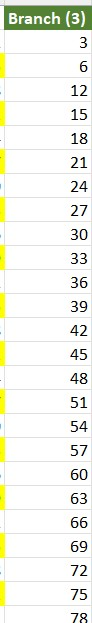
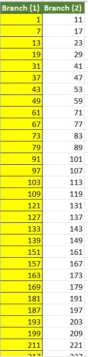
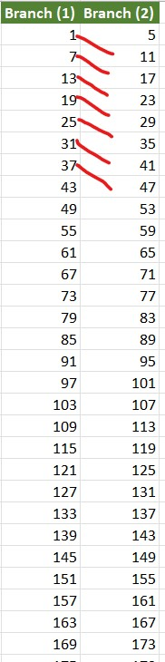
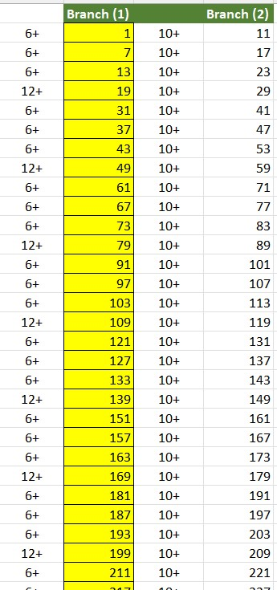
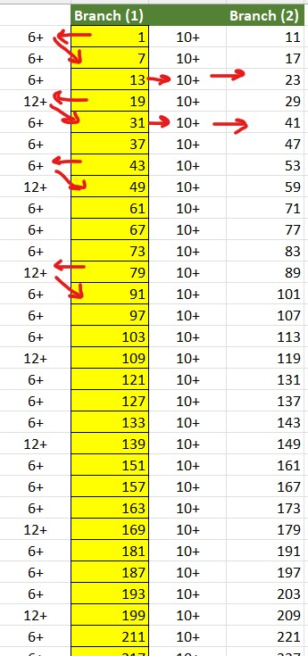
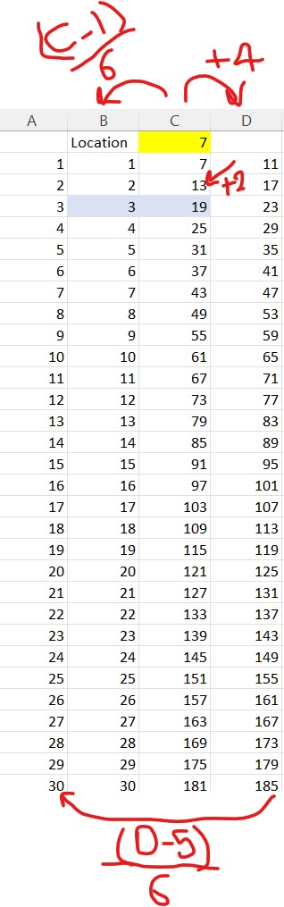
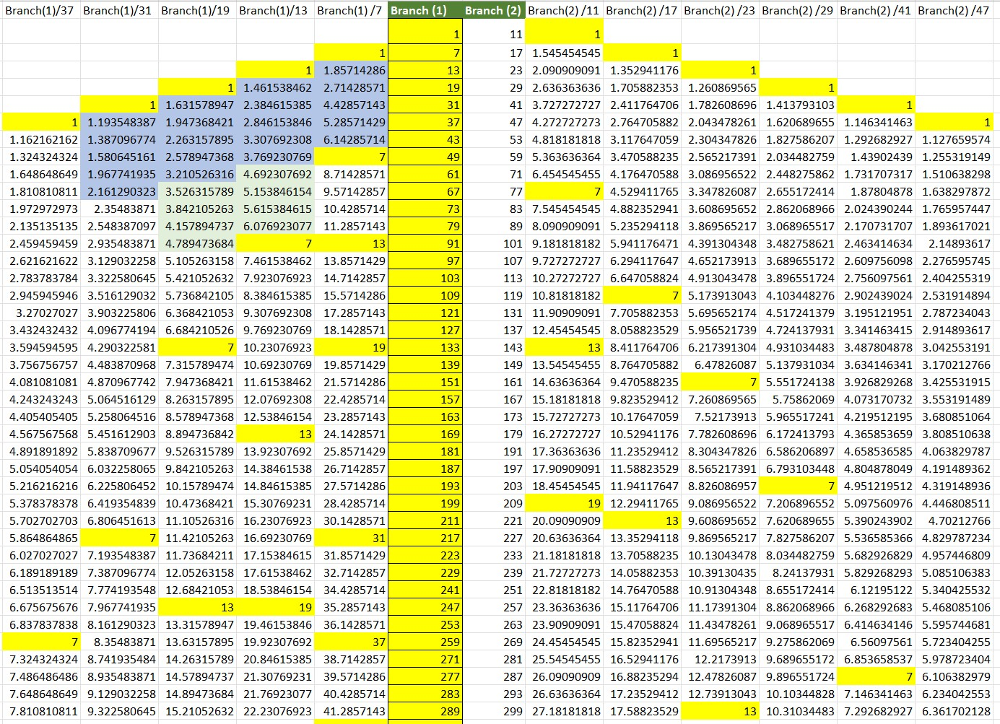

# Prime Numbers Distributions

This Repo Shows the distribution of prime numbers and what are the operations you need to apply to get the list of primes.

bascily we divide the numbers into 4 branches. 

1) Branch [2] have all evene numbers divided by 2 
2) Branch [3] have all numbers that have 3 as a factor ( multiplication table for 3) 
3) branch [7] have all numbers that are [ 7 + 6 * N ] or [ 7 + 12 * N ] at each 4 cycle
4) Branch [5] hase all numebrs that  are branch [7] + 10  or are [ 5 + 6 * N ]

based on this we only need one Branch from all the natural numbers Branch [7] numbers. and all are primes 
<table><tr>
  <td></td>
  <td> </td>
  <td></td>
  <td></td></tr>
<tr>
  <td></td>
  <td> </td>
  <td></td>
  <td></td></tr>
</table>

